# Design Patterns

## [UML 类图]([看懂UML类图和时序图 — Graphic Design Patterns (design-patterns.readthedocs.io)](https://design-patterns.readthedocs.io/zh-cn/latest/read_uml.html))

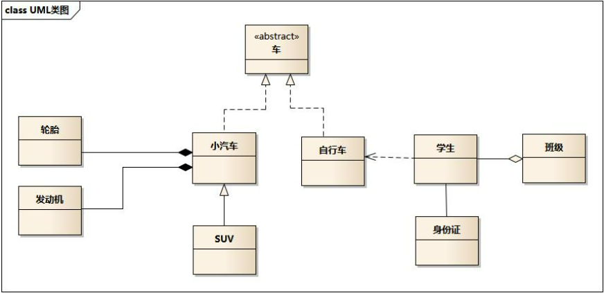 

> - 车的类图结构为<<abstract>>，表示车是一个抽象类；
> - 它有两个继承类：小汽车和自行车；它们之间的关系为实现关系，使用带空心箭头的虚线表示；
> - 小汽车为与SUV之间也是继承关系，它们之间的关系为泛化关系，使用带空心箭头的实线表示；
> - 小汽车与发动机之间是组合关系，使用带实心箭头的实线表示；
> - 学生与班级之间是聚合关系，使用带空心箭头的实线表示；
> - 学生与身份证之间为关联关系，使用一根实线表示；
> - 学生上学需要用到自行车，与自行车是一种依赖关系，使用带箭头的虚线表示；

## 设计原则

### 单一职责原则

> 单一职责的原则，有且只有一个原因能引起该类的变更。

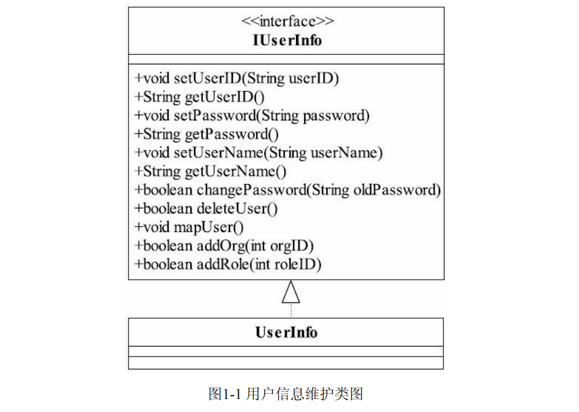 

用户的属性和用户的行为没有分开，这是一个严重的错误，应该把 **用户的信息** 抽取成一个BO（Business Object，业务对象），把 **行为** 抽取成一个 Biz（Business Logic，业务逻辑）。

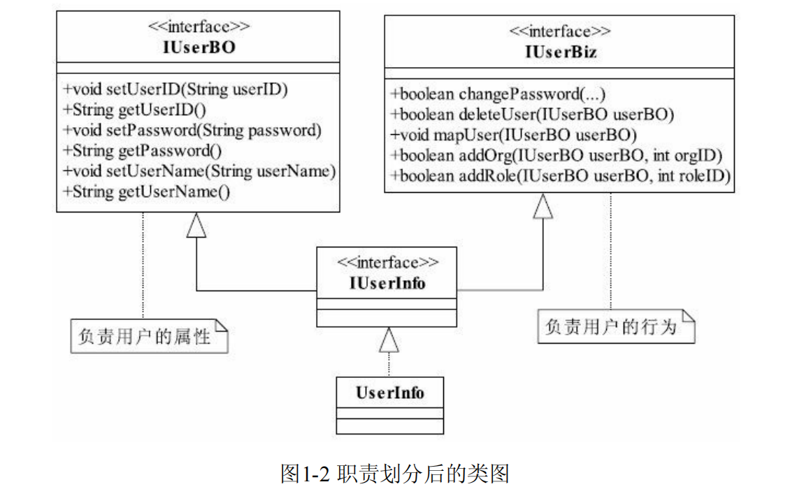 

SRP的原话解释：***<u>There should never be more than one reason for a class to change.</u>***

 电话通话的时候有4个过程发生：拨号、通话、回应、挂机其类图如图，**这个接口接近于完美，看清楚了，是“接近”！**

*<u>**单一职责原则要求一个接口或类只有一个原因引起变化，也就是一个接口或类只有一个职责，它就负责一件事情，看看上面的接口只负责一件事情吗？好像不是！**</u>*

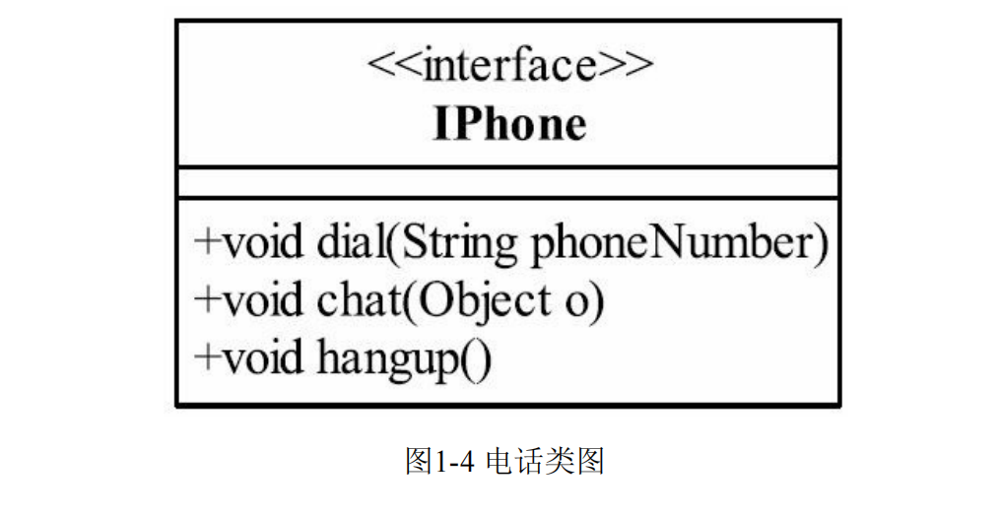 

它包含了两个职责：一个是协议管理，一个是数据传送。`dial()` 和 `hangup()` 两个方法实现的是协议管理，分别负责拨号接通和挂机。`chat()`实现的是 ***数据的传送***，把我们说的话转换成 *<u>模拟信号</u>* 或 *<u>数字信号</u>* 传递到对方，然后再把对方传递过来的信号还原成我们听得懂的语言。

<u>***考虑这个问题，协议接通的变化会引起这个接口或实现类的变化吗 ?***</u>  会的 ***数据的传送*** [电话不仅仅可以通话，还可以上网] 。

<u>***通过这样的分析，我们发现类图上的IPhone接口包含了两个职责，而且这两个职责的变化不相互影响，那就考虑拆分成两个接口。***</u>

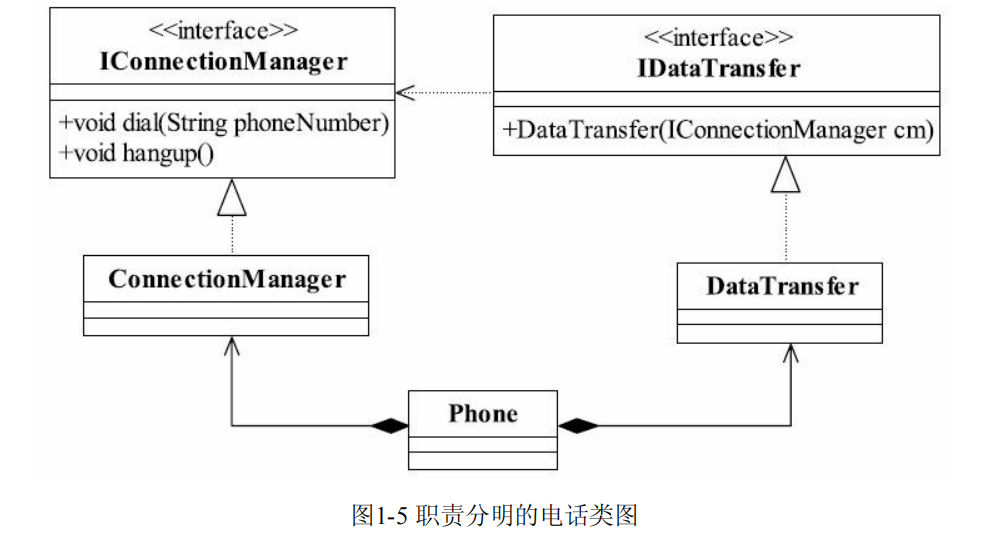 

~~~ java
// 定义连接管理器接口
public interface IConnectionManager {
    void dial(String phoneNumber);
    void hangup();
}

// 定义数据传输接口
public interface IDataTransfer {
    DataTransfer(IConnectionManager cm);
}

// 实现连接管理器接口的类
public class ConnectionManager implements IConnectionManager {
    public void dial(String phoneNumber) {
        // 实现拨打电话的方法
    }

    public void hangup() {
        // 实现挂断电话的方法
    }
}

// 实现数据传输接口的类
public class DataTransfer implements IDataTransfer {
    private IConnectionManager connectionManager;

    public DataTransfer(IConnectionManager cm) {
        this.connectionManager = cm;
    }

    // 数据传输相关的方法
    public void transferData() {
        // 使用连接管理器进行数据传输
        connectionManager.dial("123456789");
        // ...
    }
}

// 测试代码
public class Phone {
    public static void main(String[] args) {
        IConnectionManager connectionManager = new ConnectionManager();
        IDataTransfer dataTransfer = new DataTransfer(connectionManager); //组合

        dataTransfer.transferData();  // 调用数据传输方法
    }
}
~~~

一个手机类要把 `ConnectionManager` 和 `DataTransfer` 组合在一块才能使用。组合是一种强耦合关系，你和我都有共同的生命期，这样的强耦合关系还不如使用接口实现的方式呢，而且还增加了类的复杂性，多了两个类。

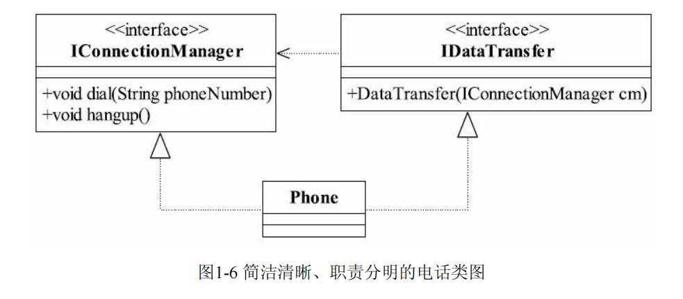 

~~~ java
// 定义连接管理器接口
public interface IConnectionManager {
    void dial(String phoneNumber);
    void hangup();
}

// 定义数据传输接口
public interface IDataTransfer {
    void transferData();
}

// 实现连接管理器接口和数据传输接口的Phone类
public class Phone implements IConnectionManager, IDataTransfer {
    @Override
    public void dial(String phoneNumber) {
        System.out.println("正在拨打号码：" + phoneNumber);
    }

    @Override
    public void hangup() {
        System.out.println("挂断电话");
    }

    @Override
    public void transferData() {
        System.out.println("开始数据传输");
    }
}

// 测试代码
public class Main {
    public static void main(String[] args) {
        // 创建一个Phone对象
        Phone phone = new Phone();

        // 拨打电话
        phone.dial("123456789");

        // 数据传输
        phone.transferData();

        // 挂断电话
        phone.hangup();
    }
}
~~~

修改一下类图这样的设计才是完美的，一个类实现了两个接口，把两个职责融合在一个类中。**<u>*你会觉得这个 Phone 有两个原因引起变化了呀*</u>**，是的，但是别忘记了我们是面向接口编程，我们对外公布的是接口而不是实现类。

> 注意: 单一职责原则提出了一个编写程序的标准，用“职责”或“变化原因”来衡量接口或类设计得是否优良，但是“职责”和“变化原因”都是不可度量的，因项目而异，因环境而异

#### 越简单越快乐

单一职责适用于接口、类，同时也适用于方法，什么意思呢？一个方法尽可能做一件事情，比如一个方法修改用户密码，不要把这个方法放到“修改用户信息”方法中，这个方法的颗粒度很粗,比如图所示的方法。

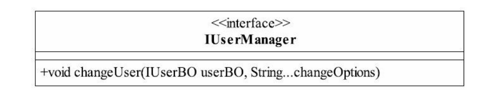 

 上图当中的该方法存在特别严重的问题，*<u>**职责不清晰，不单一**</u>*，请不要让别人猜测这个方法可能是用来处理什么逻辑的。一个方法尽可能的做到职责单一，业务单一，作用明确。

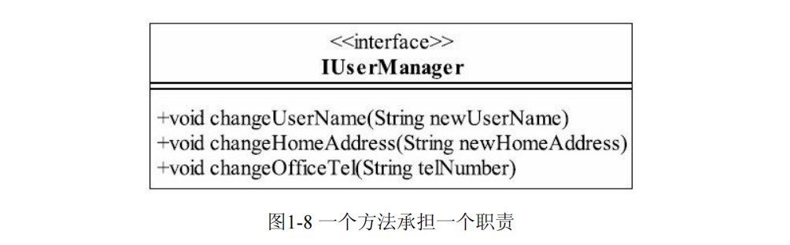 

#### 最佳实践

静下心来回忆，发觉每一个类这样设计都是有原因的。我查阅了 Wikipedia、OODesign 等几个网站，专家和我也有类似的经验，基本上类的单一职责都用了类似的一句话来说 "This is sometimes hard to see"，这句话翻译过来就是“这个有时候很难说”。

当然这个原则是非常优秀的，但是现实有现实的难处，需要考虑很多的实际业务的场景 `工期、成本、人员技术水平、硬件情况、网络情况甚至有时候还要考虑政府政策、垄断协议` 。

> 2004年我就做过一个项目，做加密处理的，甲方就甩过来一句话，你什么都不用管，调用这个API就可以了，不用考虑什么传输协议、异常处理、安全连接等。所以，我们就直接使用了JNI与加密厂商提供的API通信，什么单一职责原则，根本就不用考虑，因为对方不公布通信接口和异常判断。

### 里氏替换原则

> extends关键字来实现继承，它采用了单一继承的规则，C++则采用了多重继承的规则，一个子类可以继承多个父类。从整体上来看，利大于弊，怎么才能让“利”的因素发挥最大的作用，同时减少“弊”带来的麻烦呢？
>
> - 如果对每一个类型为S的对象o1，都有类型为T的对象o2，使得以T定义的所有程序P在所有的对象o1都代换成o2时，程序P的行为没有发生变化，那么类型S是类型T的子类型。【也就是说，程序在运行的时候，将 o2 替换成 o1 ，使用者不会感受到程序的变化，通俗点将就是 o1 继承了 o2 ，o1 拥有 o2 当中的所有属性与方法】
> - 所有引用基类的地方必须能透明地使用其子类的对象。【通俗点讲，只要父类能出现的地方子类就可以出现，而且替换为子类也不会产生任何错误或异常，使用者可能根本就不需要知道是父类还是子类。但是，反过来就不行了，有子类出现的地方，父类未必就能适应】

**里氏替换原则为良好的继承定义了一个规范，一句简单的定义包含了4层含义。** 

1. <u>***子类必须完全实现父类的方法***</u>

   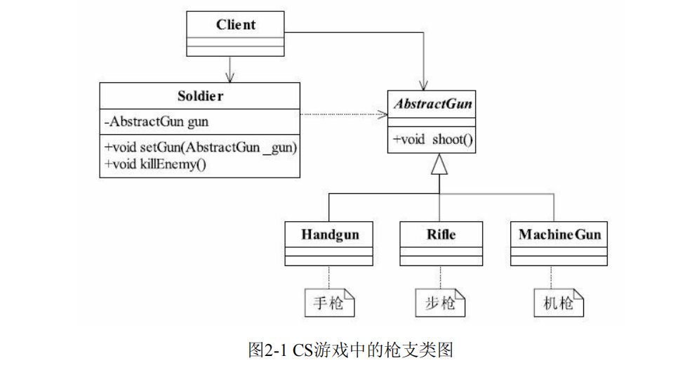

   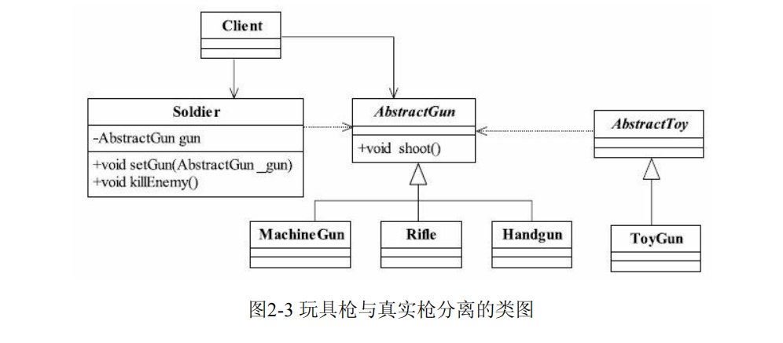

   

   ~~~ java
   public abstract class AbstractGun {
       public abstract void shoot();
   }
   ~~~

   ~~~ java
   public class MachineGun extends AbstractGun {
       @Override
       public void shoot() {
           System.out.println("Machine gun shooting...");
       }
   }
   
   public class Rifle extends AbstractGun {
       @Override
       public void shoot() {
           System.out.println("Rifle shooting...");
       }
   }
   
   public class Handgun extends AbstractGun {
       @Override
       public void shoot() {
           System.out.println("Handgun shooting...");
       }
   }
   ~~~

   ~~~ java
   public class ToyGun extends AbstractToy {
       @Override
       public void shoot() {
           System.out.println("Toy gun shooting...");
       }
   }
   ~~~

   ~~~ java
   public abstract class AbstractToy {
       public abstract void shoot();
   }
   ~~~

   ~~~ java
   public class Soldier {
       private AbstractGun gun;
   
       public void setGun(AbstractGun gun) {
           this.gun = gun;
       }
   
       public void killEnemy() {
           if (gun != null) {
               gun.shoot();
           } else {
               System.out.println("No gun available to shoot.");
           }
       }
   }
   ~~~

   

     

2. <u>***子类可以有自己的个性***</u>

   子类当然可以有自己的行为和外观了，也就是方法和属性，<u>***里氏替换原则可以正着用，但是不能反过来用***</u>。以刚才的关于枪支的例子为例，步枪有几个比较“响亮”的型号，比如AK47、AUG 狙击步枪等，把这两个型号的枪引入后的Rifle子类图如图。

   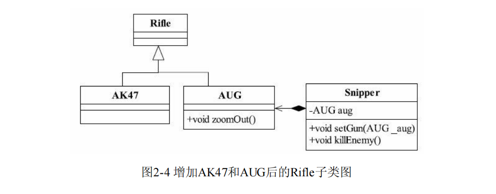 

   很简单，AUG继承了Rifle类，狙击手（Snipper）则直接使用AUG狙击步枪。有狙击枪就有狙击手，狙击手类的源代码如代码。

   ~~~ java
   public class AUG extends Rifle {
       //狙击枪都携带一个精准的望远镜
       public void zoomOut(){
           System.out.println("通过望远镜察看敌人...");
       }
       public void shoot(){
           System.out.println("AUG射击...");
       }
   }
   ~~~

   ~~~ java
   public class Snipper {
       public void killEnemy(AUG aug){
           //首先看看敌人的情况，别杀死敌人，自己也被人干掉
           aug.zoomOut();
           //开始射击
           aug.shoot();
       }
   }
   ~~~

   狙击手使用 AUG 开枪射击，这个代码没有任何的问题。

   ~~~ java
   public class Client {
       public static void main(String[] args) {
           //产生三毛这个狙击手
       Snipper sanMao = new Snipper();
       sanMao.setRifle(new AUG());
       sanMao.killEnemy();
       }
   }
   ~~~

   但如果换成下面的代码，就明显无法调用 开镜狙击 的功能。会在运行期抛出java.lang.ClassCastException异常，这也是大家经常说的向下转型（downcast）是不安全的，从里氏替换原则来看，就是有子类出现的地方父类未必就可以出现。

   ~~~ java
   public class Client {
       public static void main(String[] args) {
           //产生三毛这个狙击手
           Snipper sanMao = new Snipper();
           sanMao.setRifle((AUG)(new Rifle()));
           sanMao.killEnemy();
       }
   }
   ~~~

3. <u>***覆盖或实现父类的方法时输入参数可以被放大***</u>

   方法中的输入参数称为前置条件，

### 依赖倒置原则

### 接口隔离原则

### 迪米特拉法则

### 开闭原则

