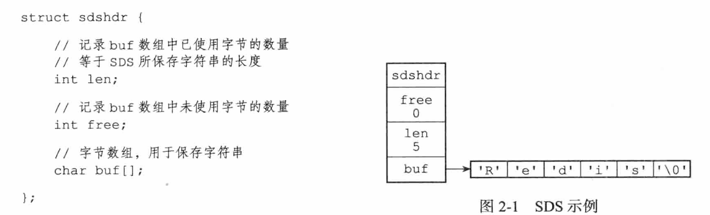
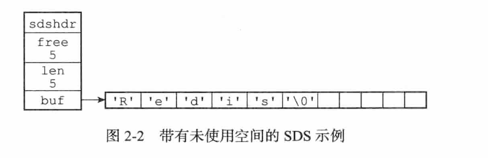
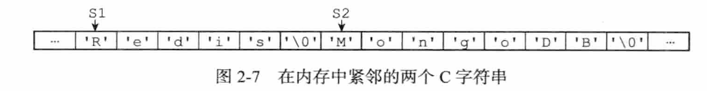
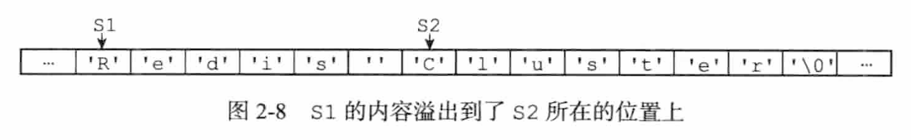

# Redis 设计与实现

## 简单动态字符串

### SDS 的结构简单介绍

在 C 语言的内部所有的关于字符串的存储都是以 `SDS` 这种结构来存储的，而并非通过传统的 C 字符串表示.针对于 C 字符串这种形式的存储，一般都是用作字符串字面量来使用。

下图是 sds.h/sdshdr 结构当中表示的 `SDS` 值 :

可以看到在 buf 字节数组当中，保留的字符串结尾还是采用了 C 语言 当中 C 字符串的原始基本结构字符串+`\0` 作为结束标识符。但这里的 len 也就是 SDS 当中存储的字符串长度并不包含 `\0` ,如果所示 buf 数组所占内存总大小为 6 个字节，但有效长度为 5 字节。

> redis 之所以这样以 C 原始的字符串存储格式其主要是为了与 C 语言当中的字符串函数库兼容，保证可以重用其中一部分的功能函数。

比如在 `<stdio.h> `库下的 `printf` 函数，就可以通过指向 SDS 的指针直接调用进行打印，比如

~~~  c
printf("%s",s->buf);
~~~

### SDS 与 C 字符串之间的区别

对于 C 语言而言本身就是 C 字符串这样的存储结构，为什么还需要在 Redis 当中引入新的字符串存储结构呢？无论是对于一个新的技术或者新的概念引入，这些聪明的先驱们一定是为了解决在某一区域尚且无法解决的问题，而非是为了无聊。

所以 SDS 的存储其就是为解决 Redis 在安全性、效率、以及某些功能方法的特殊需求而诞生的。

#### 常熟复杂度获取字符串的长度

~~~ c
char site[] = "Hobbit Plant";

~~~

在 C字符串 当中当我们赋值一串字符给 C 语言字符串对象时，同时开辟了一片连续的内存空间给该变量，当获取改变量的大小时，其本身就是从改字符串的首地址开始逐个遍历自加1，直到最后的遇到 `\0` 这样的标识符结束。很明显可以看到 C字符串 结构由于太过于简单，所有每次获取字符串的长度时都需要重新遍历一遍时间复杂度为 O(n)，而由于 SDS 结构当中存储了有效的字符串长度，其时间复杂度不受其字符串存储的长度影响，其复杂度始终是一个常数 O(1).

这就很好的避免了不会因为在 Redis 的工作当中，比如当客户端在通过 **命令 STRLEN 获取指定 Key 所存储的字符串长度的时候** 不会因为获取字符串长度而成为一个性能短板.

#### SDS 当中的 free 字段的妙用

如图所示这表示一个字符串长度为 5 ，目前可用空间的大小为 5 的 SDS 存储结构。

##### 杜绝缓存区溢出

- C 字符串的内存溢出问题

现在假设我们申请两个属性分别为 `s1= "Redis"` `s2="MongoDB"` ,而这两片内存空间恰好是连续的，结构如图所示：

而当我们想执行 `strcat(s1,"Cluster")` 该函数的时候，恰巧忘记了为 `s1` 变量划分足够能容纳 `"Cluster"` 的空间，这个时候 **"Cluster"** 字符就 会相比之前的 `s1` 属性多出一位，而多出的这一位就会将 `s2` 变量原有的空间的内存挤占掉，出现 `s1` 变量的 **内存溢出** 问题。

- SDS 当中的 free

##### 减少修改字符串带来的内存重新分配次数

1. 空间预分配

   

2. 惰性空间释放

##### 二进制安全

##### 兼容部分的 C 字符串函数